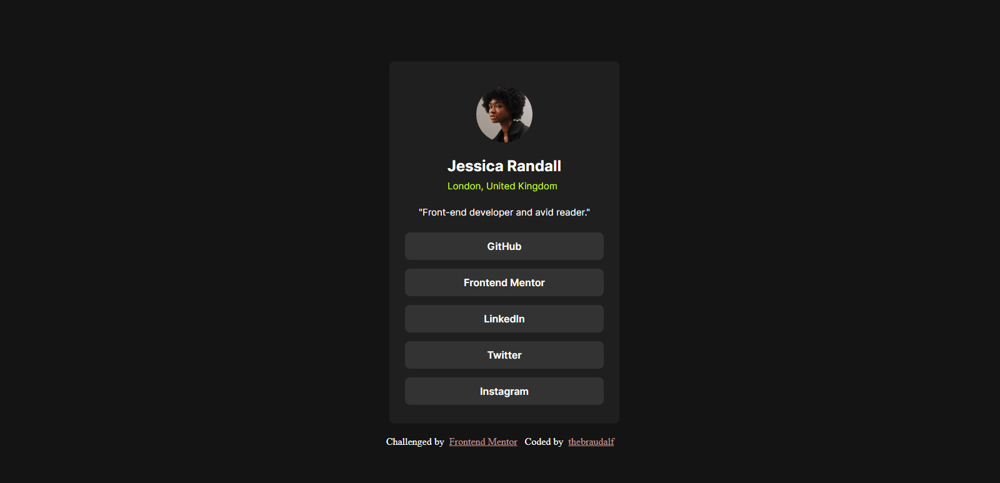

# Frontend Mentor - Social links profile solution

This is a solution to the [Social links profile challenge on Frontend Mentor](https://www.frontendmentor.io/challenges/social-links-profile-UG32l9m6dQ). Frontend Mentor challenges help you improve your coding skills by building realistic projects. 

## Table of contents

- [Overview](#overview)
  - [The challenge](#the-challenge)
  - [Screenshot](#screenshot)
  - [Links](#links)
- [My process](#my-process)
  - [Built with](#built-with)
  - [What I learned](#what-i-learned)
  
  - [Useful resources](#useful-resources)
- [Author](#author)

## Overview

### The challenge

Users should be able to:

- See hover and focus states for all interactive elements on the page

### Screenshot




### Links

- Solution URL: [Social links profile](https://your-solution-url.com)
- Live Site URL: [Social links profile](https://your-live-site-url.com)

## My process

### Built with

- CSS custom properties
- Flexbox
- Media Query
### What I learned

Here I learned about proper use of color palatte.

Code snippets, see below:

```css
.container{
    width: 23%;
    height: 75vh;
    margin: 105px 601px 28px;
    border-radius: 8px;
    background-color: hsl(0, 0%, 12%);
}

.el1 span{
    font-family: "inter";
    font-size: 15px;
    color: hsl(75, 94%, 57%);
}
```

### Useful resources

- [FlexBox](https://developer.mozilla.org/en-US/docs/Web/CSS/flex) - This helped me for changing the flex direction to column. I really liked this pattern and will use it going forward.

## Author

- Frontend Mentor - [@thebraudalf](https://www.frontendmentor.io/profile/thebraudalf)
